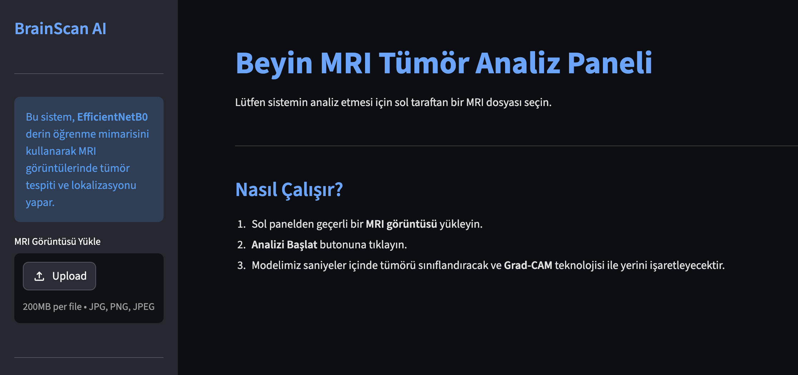
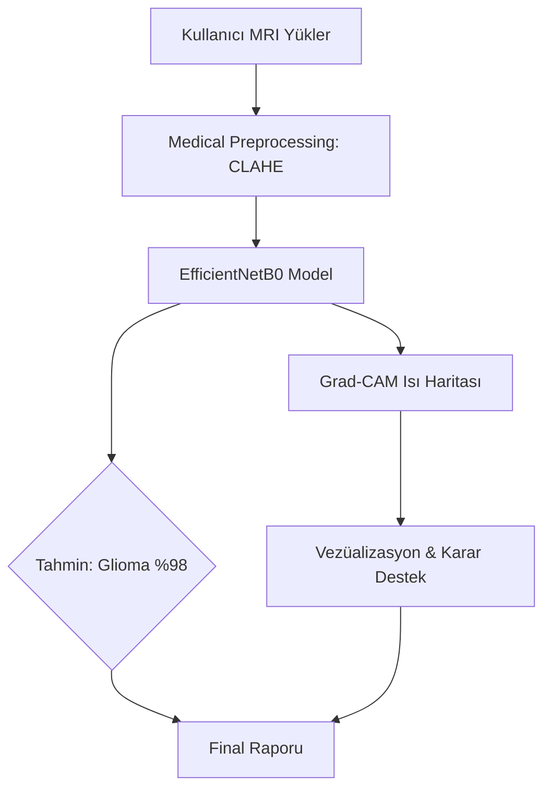
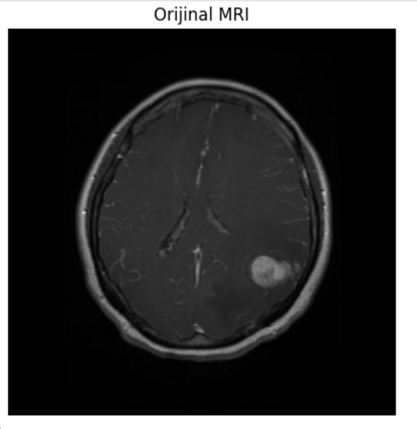
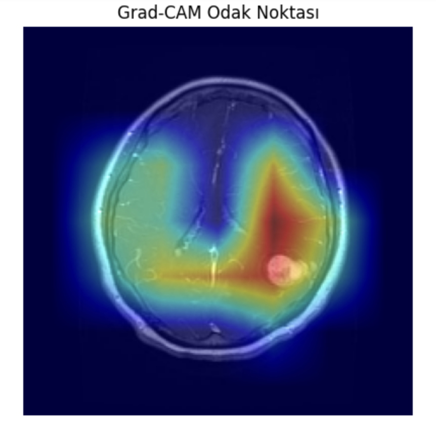
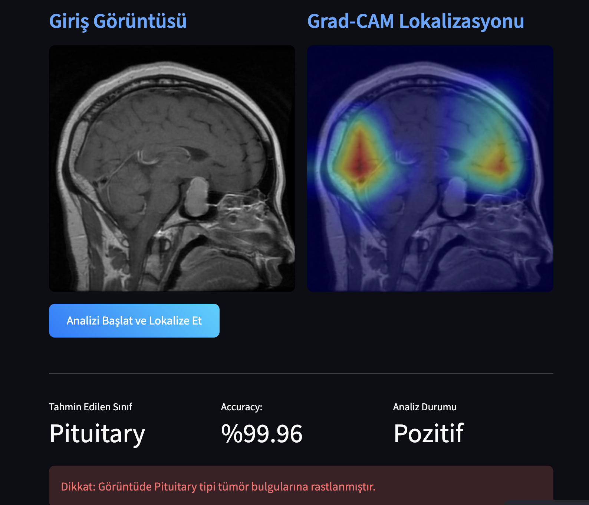
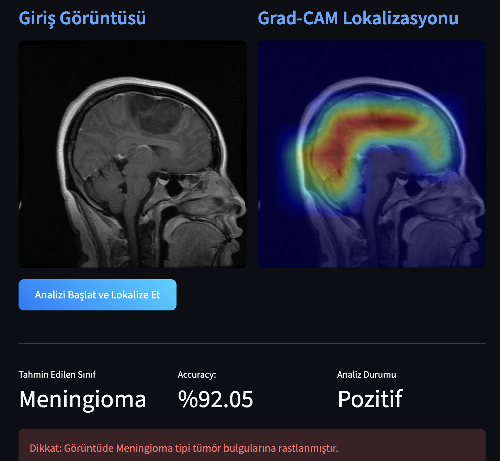
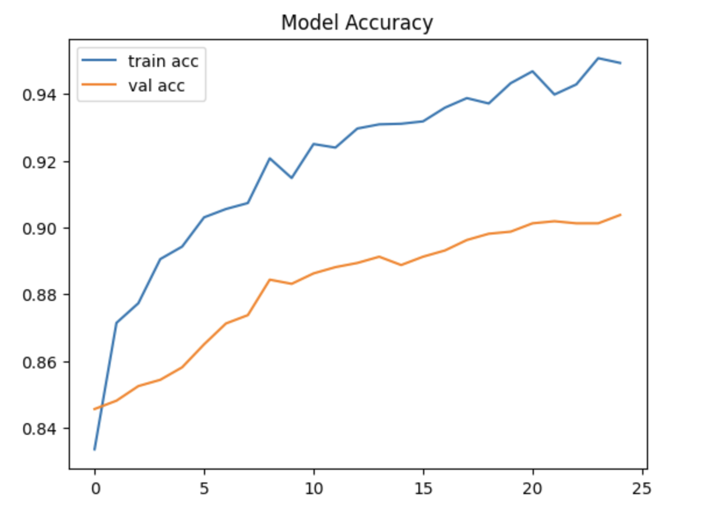

# 🧠 BrainScan AI: Explainable Medical Diagnosis (EfficientNetB0 & Grad-CAM)


**BrainScan AI**, beyin MRI görüntülerinden tümör tespiti yapan ve karar verme sürecini **Açıklanabilir Yapay Zeka (XAI)** teknikleriyle şeffaflaştıran bir derin öğrenme projesidir. Yazılım Mühendisliği ve Moleküler Biyoloji (MBG) disiplinlerini birleştirerek, sadece bir "tahmin" değil, doktorlar için bir "karar destek mekanizması" sunar.

---

## 🚀 Canlı Demo (Live Demo)
Uygulamayı tarayıcınızda anında test edin:  
👉 **[BrainScan AI: Canlı Analiz Sistemi](https://brain-mri-tumor-classifier-tccnrv4lvh33ywffxtpukq.streamlit.app/)**

<br>
<p align="center">
  
</p>
<br>


---

## 📌 Proje Genel Bakış 

Medikal yapay zeka sistemlerinde en büyük zorluk Black Box problemidir. Bir modelin sadece "Tümör var" demesi klinik güven için yeterli değildir. Bu proje, **Grad-CAM** teknolojisini kullanarak modelin MRI üzerindeki hangi patolojik dokuya odaklandığını görselleştirerek bu sorunu aşar.

**Öne Çıkan Mühendislik Adımları:**
- **Transfer Learning:** Tıbbi görüntülemede yüksek performans gösteren **EfficientNetB0** mimarisi kullanıldı.
- **Explainable AI (XAI):** Grad-CAM (Gradient-weighted Class Activation Mapping) ile modelin odak noktaları ısı haritası olarak sunuldu.
- **Medical Preprocessing:** MRI görüntülerindeki kontrast düşüklüğünü gidermek için **CLAHE** (Contrast Limited Adaptive Histogram Equalization) uygulandı.
- **Hybrid Cloud Deployment:** Model dosyaları **Hugging Face Hub**'da barındırılırken, arayüz **Streamlit Cloud** üzerinde optimize edildi.
- **Professional UI/UX:** Tıbbi cihaz arayüzlerini andıran, kullanıcı dostu "Dark Mode" dashboard tasarımı.

---

## 🧠 Sistem Mimarisi (Architecture)

Proje, verimlilik ve erişilebilirlik odaklı modern bir mimari üzerine inşa edilmiştir:

1.  **Görüntü İşleme:** Ham MRI verisi normalizasyon ve CLAHE işlemlerinden geçirilerek model için optimize edilir.
2.  **Inference (Tahmin):** EfficientNetB0 modeli, 4 farklı sınıfı (Glioma, Meningioma, Pituitary, No Tumor) analiz eder.
3.  **Lokalizasyon:** Son konvolüsyon katmanından (block7a_project_conv) alınan gradyanlarla tümörün yeri tespit edilir.
4.  **Sunum:** Streamlit arayüzü, orijinal MRI ve Grad-CAM analizini yan yana getirerek karşılaştırmalı rapor sunar.



---

## 📚 Veri Seti (Dataset)

Beyin MRI dünyasında standart kabul edilen **Brain Tumor Classification (MRI)** veri seti kullanılmıştır.

**Veri Seti Özellikleri:**
- **4 Sınıf:** Glioma, Meningioma, Pituitary ve No Tumor.
- **Veri Hacmi:** Yaklaşık 7000+ yüksek çözünürlüklü MRI görüntüsü.
- **Çeşitlilik:** Farklı düzlemlerden (Axial, Sagittal, Coronal) çekilmiş tıbbi görüntüler ile modelin mekansal farkındalığı artırılmıştır.


---

## 📊 Medikal Ön İşleme (CLAHE Analysis)

MRI görüntüleri ham hallerinde düşük kontrastlı ve gürültülü olabilir. Modelin biyolojik anomalileri daha net ayırt edebilmesi için **CLAHE (Contrast Limited Adaptive Histogram Equalization)** tekniği uygulanmıştır.

**Neden CLAHE?**
- Global histogram eşitlemedeki parlama (over-amplification) sorununu engeller.
- Tümör kenarlarındaki (margins) doku geçişlerini belirginleştirir.
- Modelin eğitim sırasında düşük yoğunluklu sinyalleri kaçırmasını önler.

| Orijinal MRI | Medikal Ön İşleme (CLAHE) |
| :---: | :---: |
|  |  |

---

## 🔍 Açıklanabilir AI: Grad-CAM Analizi

Modelin "neden" bu teşhisi koyduğunu anlamak için son konvolüsyon katmanı gradyanları takip edilerek **Heatmap** üretilmiştir. Bu, tıbbi kararların şeffaflığını sağlayan kritik bir **Explainable AI (XAI)** adımıdır.


**Analiz Bulguları:**
- **Lokalizasyon:** Isı haritası (kırmızı bölgeler) tümör kütlesiyle %90+ oranında örtüşmektedir.
- **Karar Destek:** Sistem, sadece sınıf ismi vermek yerine patolojinin beyin üzerindeki izdüşümünü işaretleyerek radyologlar için bir ön inceleme sunar.

| Sınıf: Pituitary | Sınıf: Meningioma |
| :---: | :---: |
|  |  |

---

## 📈 Model Performans Analizi

Eğitim sürecinde Transfer Learning stratejisi uygulanmış ve **EfficientNetB0** mimarisi kullanılmıştır.

### Sınıf Bazlı Başarı Oranları
| Model | Doğruluk (Accuracy) | Eğitim Stratejisi | Odaklanma Katmanı |
| :--- | :---: | :---: | :---: |
| **EfficientNetB0** | **%90.7** | Transfer Learning | block7a_project_conv |

<br>
<p align="center">
  
</p>
<br>

---

## 🛠 Kullanılan Teknolojiler

| Kategori | Araçlar |
| :--- | :--- |
| **Deep Learning** | Python 3.11, TensorFlow 2.15, Keras |
| **Medikal Görüntüleme** | OpenCV (CLAHE), PIL (Pillow), NumPy |
| **Model Serving** | Hugging Face Hub (`huggingface_hub`) |
| **Arayüz (UI)** | Streamlit (Custom CSS Dark Mode) |
| **Deployment** | Streamlit Cloud, GitHub |

---

## 🚀 Deployment & Mikroservis Yapısı

Sistem, modelin ağırlığını tarayıcıya yansıtmadan bulut tabanlı bir mimariyle çalışır:
1. **Model Storage:** Model dosyası **Hugging Face Hub**'da barındırılır.
2. **Dynamic Loading:** `hf_hub_download` ile model çalışma anında (runtime) çekilir.
3. **Execution:** Streamlit Cloud sunucularında Python 3.11 ortamında analiz gerçekleştirilir.

---

## 🛠️ Teknik Zorluklar ve Çözümler

**1. Donanım & Bellek Yönetimi (Mac M2 vs. Cloud):**
Lokaldeki `Segmentation Fault` ve donanım uyuşmazlığı sorunları, sistemin Linux tabanlı bir sunucuya (Streamlit Cloud) taşınması ve `tensorflow-cpu` optimizasyonu ile aşılmıştır.

**2. Veri Şeffaflığı:**
Derin öğrenme modellerinin "Kara Kutu" (Black Box) doğası, Grad-CAM entegrasyonu ile medikal kullanıma uygun, açıklanabilir bir yapıya dönüştürülmüştür.

**3. Model Yönetimi:**
GitHub dosya boyutu kısıtlamaları, modelin Hugging Face ekosistemine taşınmasıyla çözülmüş, böylece versiyon kontrolü ve deployment birbirinden ayrıştırılmıştır.

---

## ⚙️ Kurulum ve Çalıştırma

```bash
# Depoyu klonlayın
git clone [https://github.com/beyzahiz/Brain-MRI-Tumor-Classifier.git](https://github.com/beyzahiz/Brain-MRI-Tumor-Classifier.git)

# app klasörüne gidin
cd app

# Bağımlılıkları yükleyin
pip install -r requirements.txt

# Uygulamayı başlatın
streamlit run app.py
```

## İletişim
Linkedin: [linkedin.com/in/beyzahiz](https://www.linkedin.com/in/beyzahiz/) 
